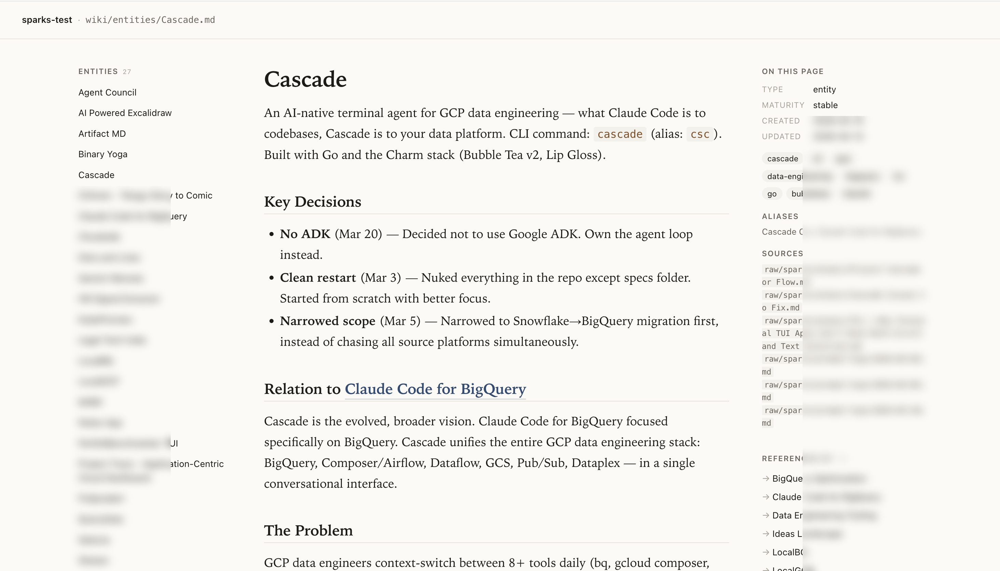

# Sparks

**Knowledge base runtime for AI agents.** A single Go binary that maintains the mechanical integrity of a personal-scale knowledge base, so any agent — Claude Code, Codex CLI, Gemini CLI, or whatever ships next — can operate it through one CLI or one MCP server.

Not a notes app. Not an editor. Not a sync tool. A runtime.

## Why

Personal knowledge management tools are designed for human interaction. The emerging pattern is different: humans capture, AI agents maintain. When the operational logic lives as prose in one agent's config file (`CLAUDE.md`, `AGENTS.md`, `GEMINI.md`), the agent ends up doing two very different kinds of work:

1. **Mechanical** — parsing frontmatter, splitting inbox entries, hashing files, detecting orphan links, regenerating collection indexes, archiving, git commits. Deterministic. Doesn't need a language model.
2. **Semantic** — understanding content, deciding what pages to create, writing page content, synthesizing answers, spotting contradictions. The work a model is actually good at.

Trapping mechanical work in prose couples the vault to one agent, burns tokens on regex, and makes the whole system brittle. Sparks extracts the mechanical layer into a binary. Agents do content work. Sparks does plumbing.

The agent's instructions collapse from ~200 lines of prose to:

```
1. sparks ingest --prepare
2. Read its output. Create or update wiki pages for each entry.
3. sparks ingest --finalize
```

## Install

### Homebrew

Sparks reuses the maintainer's existing tap (originally for `tgcp`), so the install path looks slightly off but works:

```bash
brew install yogirk/tgcp/sparks
```

### Go install

```bash
go install github.com/yogirk/sparks/cmd/sparks@latest
```

### From source

```bash
git clone https://github.com/yogirk/sparks
cd sparks
go build -o sparks ./cmd/sparks
```

### Pre-built binaries

Grab a binary for darwin/linux/windows on amd64/arm64 from the [Releases page](https://github.com/yogirk/sparks/releases).

## Quickstart

```bash
# Create a vault and tell Claude Code how to drive it.
mkdir ~/Projects/notes/my-vault
cd ~/Projects/notes/my-vault
sparks init --agent claude     # creates sparks.toml + dir layout + CLAUDE.md
git init -b main               # optional, enables auto-commit on ingest

# Capture into the inbox like you always would.
echo "
---
2026-04-14
First capture: had an idea about agent runtimes.
" >> inbox.md

# Now your agent can drive the vault. Inside Claude Code:
#   sparks ingest --prepare    → reads inbox, classifies hints, opens an ingest row
#   (Claude reads the JSON, creates/updates wiki pages)
#   sparks ingest --finalize   → archives, clears inbox, scans, commits
```

For a longer walk-through aimed at first-time agent users (Claude Code, Codex CLI, Gemini CLI, MCP), see [GETTING_STARTED.md](GETTING_STARTED.md).

## Architecture

Three layers:

```
┌─────────────────────────────────────────────┐
│ raw/       ← append-only human capture      │
├─────────────────────────────────────────────┤
│ wiki/      ← agent-maintained derived view  │
├─────────────────────────────────────────────┤
│ sparks.db  ← CLI-maintained manifest        │
└─────────────────────────────────────────────┘
```

Raw is the source of truth. Wiki is a derived view. Manifest tracks state for incremental operations. All three are plain files on disk, versioned by git.

The full agent-runtime contract — page types, frontmatter schema, ingest protocol, ownership boundaries, what NOT to do — lives in [`sparks-contracts.md`](sparks-contracts.md) and is embedded in the binary. Any agent can ask:

```bash
sparks describe
```

…and get the canonical contract. That same content is what `sparks init --agent X` writes to `CLAUDE.md` / `AGENTS.md` / `GEMINI.md`.

## Commands

```
sparks init [path] [--agent claude|codex|gemini|generic] [--force]
sparks scan
sparks status
sparks ingest --prepare | --finalize | --abort  [-m "message"]
sparks done <query>
sparks tasks add --section "[[X]]" --text "..."
sparks lint  [--json]
sparks fmt   [glob] [--check]
sparks collections regen [name...] [--dry-run] [--json]
sparks index [--dry-run]
sparks query --title|--alias|--tag|--type|--maturity|--linked-from|--links-to|--stale|--orphan
sparks affected [--json]
sparks brief [--days N] [--json]
sparks describe
sparks serve     # MCP stdio server with all 12 operations as tools
sparks view      # local HTTP wiki viewer on localhost:3030
```

Run `sparks <command> --help` for the full flag list.

## Browse your vault locally

No Obsidian? No problem. `sparks view` ships a zero-dependency local wiki viewer inside the binary. One command, no config:

```bash
cd ~/Projects/notes/my-vault
sparks view --open     # opens http://127.0.0.1:3030 in your browser
```



Three-column layout: left sidebar (vault navigation by page type), center reading column (serif typography, narrow measure, resolved wikilinks), right sidebar (page metadata, tags, backlinks). Broken wikilinks are styled distinctly so you spot gaps at a glance.

Read-only by design. Edits happen in your editor or via your agent. File changes show up on the next page refresh, no watcher or restart needed.

## Working with agents

Sparks ships three adapter surfaces over the same internal core:

- **CLI.** Thin cobra adapters. Agents shell out and parse JSON.
- **MCP stdio server.** `sparks serve` exposes the same operations as MCP tools (`sparks_scan`, `sparks_prepare_ingest`, `sparks_lint`, `sparks_query`, etc.). Any harness that speaks MCP can drive a vault without shell-out.
- **Web viewer.** `sparks view` renders wiki pages as HTML locally. Not agent-facing, but the tool you use to browse what agents built.

All three surfaces stay in sync because they call the same `internal/core` package. An architecture-guard test fails the build if business logic leaks into any adapter.

## Design philosophy

The harness should be thin. Tools should be specialized. Let models reason and process language. Let binaries handle file hashing, frontmatter parsing, and link graph traversal. When the runtime encodes the contract, a new agent can drive the vault without anyone rewriting prose.

The shape (entity / concept / summary / synthesis / collection page types, fixed frontmatter schema, eight collection extractors) is hardcoded in v1. This is the [Karpathy LLM wiki pattern](https://gist.github.com/karpathy/442a6bf5559148d1f0681fc3aa3d83d6) productized as a runtime. v2 may make the shape declarative if there's demand — opinionated first, generalize on signal.

Background notes:

- [`sparks-insight.md`](sparks-insight.md) — the one-page thesis
- [`sparks-spec.md`](sparks-spec.md) — full v1 spec
- [`sparks-contracts.md`](sparks-contracts.md) — the runtime contract (also embedded in the binary)
- [`TODOS.md`](TODOS.md) — post-v1 work tracked here

## Status

v0.1.0 first release. Used in production against the maintainer's personal vault. Should work for any vault that follows the contract, but the dogfood-to-other-vaults loop is just starting.

If you adopt Sparks, please [open an issue](https://github.com/yogirk/sparks/issues) — what worked, what was confusing, what your shape needed that v1 doesn't have.

## License

[MIT](LICENSE).
